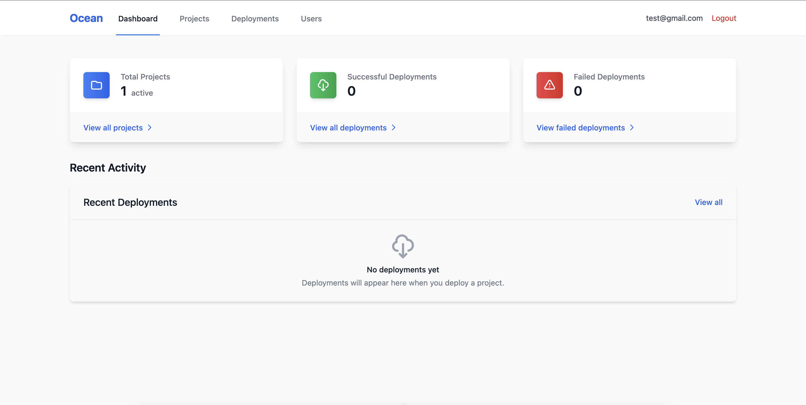
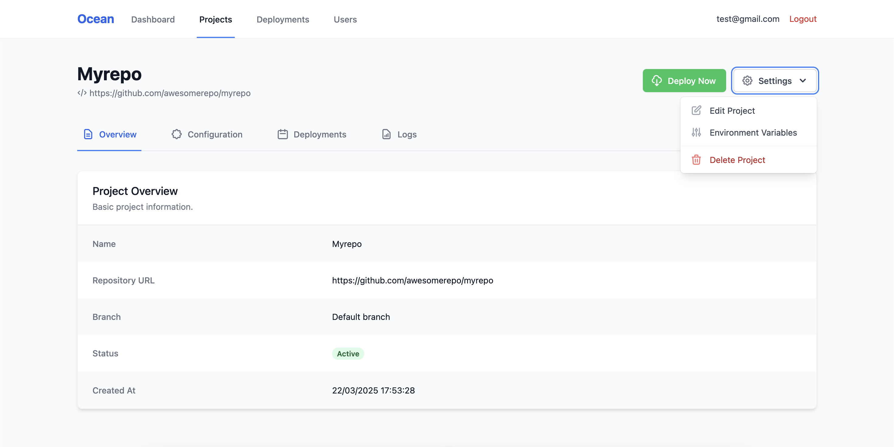

# Ocean - Deployment Automation Tool

> ⚠️ **WARNING: This project is for development and testing purposes only. It is NOT intended for production use.**

> ⚠️ **WARNING 2: ./scripts/deploy.sh may not work as expected. It needs some updates and we don't have the necessary time to update it at the moment.** 

Ocean is a deployment automation tool that monitors GitHub repositories and automatically deploys changes to Docker containers. It provides a user-friendly interface for configuring repositories, monitoring deployments, and managing the deployment process.


*Ocean's dashboard interface showing deployment status and project management*


*Project details page with environment variables management*

## ⚠️ Important Notice

This project is designed for:
- Development environments
- Testing and learning purposes
- Local or controlled network deployments

It should NOT be used in:
- Production environments
- Mission-critical systems
- Public-facing deployments
- Systems requiring enterprise-grade security

## Features

- GitHub webhook integration for automatic deployments
- Support for multiple projects and repositories
- Real-time deployment status monitoring
- Configurable deployment settings per project
- Docker container management
- Deployment history and logs
- Environment variables management with automatic redeployment
- SSH tunneling for exposing deployments

## Prerequisites

- Node.js (v16 or higher)
- Docker
- PostgreSQL
- Git
- SSH access to a remote server for tunneling (optional)

## Tech Stack

- **Frontend**: Nuxt.js with Tailwind CSS
- **Backend**: NestJS
- **Database**: PostgreSQL
- **Deployment**: Docker
- **Scripts**: Bash

## Project Structure

```
├── frontend/           # Nuxt.js frontend application
├── backend/           # NestJS backend application
├── scripts/           # Bash scripts for deployment
└── docker/            # Docker configuration files
```

## Getting Started

1. Clone the repository:
   ```bash
   git clone https://github.com/yourusername/ocean.git
   cd ocean
   ```

2. Set up the backend:
   ```bash
   cd backend
   cp .env.example .env  # Configure your environment variables
   npm install
   npm run start:dev
   ```

3. Set up the frontend:
   ```bash
   cd frontend
   cp .env.example .env  # Configure your environment variables
   npm install
   npm run dev
   ```

4. Configure your database:
   - Create a PostgreSQL database
   - Update the database connection string in backend/.env
   - Run migrations: `cd backend && npx prisma migrate deploy`

## Environment Variables

Ocean allows you to manage environment variables for your projects:

1. Navigate to the project details page
2. Click on "Environment Variables"
3. Add, edit, or delete environment variables as needed

Changes to environment variables will automatically trigger a redeployment of your project.

## Docker Deployment

Ocean deploys projects in Docker containers by default. The deployment process:

1. Creates a Dockerfile if one doesn't exist (assumes Node.js projects by default)
2. Builds the Docker image using the project's build commands
3. Runs the container with the appropriate environment variables
4. Exposes the default port (3000 for Node.js projects)

You can customize the deployment by providing:
- `installCommand`: Command to install dependencies (default: `npm install`)
- `buildCommand`: Command to build the project (if needed)
- `startCommand`: Command to start the application (default: `npm start`)

## SSH Tunneling

Ocean uses SSH tunneling to make your deployments accessible:

1. Configure your SSH tunnel host in the backend environment variables
2. Each project gets assigned a unique port
3. Deployments are accessible via the tunnel URL

## Security Considerations

Since this is a development tool, please be aware of these security considerations:

- Do not expose the application to the public internet
- Use strong passwords for database and admin access
- Keep your environment variables secure
- Regularly update dependencies
- Monitor Docker container resource usage

## Contributing

Contributions are welcome! Please read our [Contributing Guidelines](CONTRIBUTING.md) for details on our code of conduct and the process for submitting pull requests.

## Development

To start the application in development mode:

```bash
# Start the backend
cd backend
npm install
npm run start:dev

# Start the frontend in another terminal
cd frontend
npm install
npm run dev
```

## License

This project is licensed under the MIT License - see the [LICENSE](LICENSE) file for details.

## Disclaimer

This software is provided "as is", without warranty of any kind. Use at your own risk. The authors or contributors cannot be held liable for any damages arising from the use of this software.